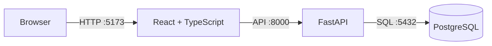

# Foundation architecture

The Phase 2 development environment has three services managed by Docker Compose.

The backend owns validation and persistence. The frontend never connects directly to the database.
Browser requests from configured `CORS_ORIGINS` are accepted by the backend; the default permits the
local Vite development server at `http://localhost:5173`.
ML training and inference code will live under `ml/` and will be integrated in later phases through
explicit backend service contracts.

## Service boundaries

| Component | Current responsibility | Later responsibility |
| --- | --- | --- |
| Frontend | Development landing page | Analyst dashboard and attack graph |
| Backend | Health, intelligence APIs, correlation, graph, risk, response | Full platform APIs |
| PostgreSQL | Initial platform schema | Event, alert, incident, and graph persistence |
| ML | Preprocessing, Logistic Regression, SHAP, causal GraphSAGE | Additional model training and inference |
