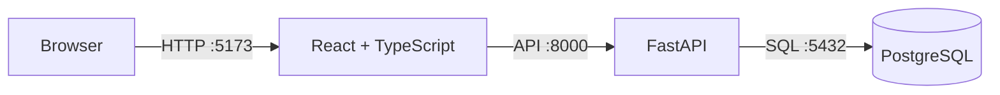
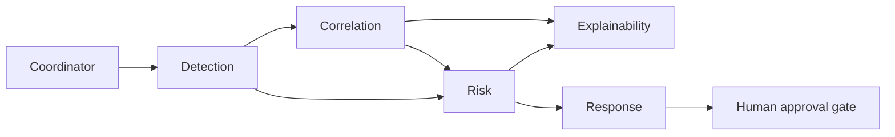

# Foundation architecture

The Phase 2 development environment has three services managed by Docker Compose.

The backend owns validation and persistence. The frontend never connects directly to the database.
Browser requests from configured `CORS_ORIGINS` are accepted by the backend; the default permits the
local Vite development server at `http://localhost:5173`.
Offline ML training and evaluation live under `ml/`. The backend's bounded Phase 5 agents integrate
the intelligence components through strict service contracts and a failure-aware coordinator.

## Intelligence workflow

Every arrow is a validated `phase5-v1` Pydantic handoff. The coordinator returns ordered audit
digests and keeps the approval gate pending; no response component has an execution capability.

## Service boundaries

| Component | Current responsibility | Later responsibility |
| --- | --- | --- |
| Frontend | Development landing page | Analyst dashboard and attack graph |
| Backend | Health, intelligence APIs, five bounded agents, coordinator | Persistent authenticated platform APIs |
| PostgreSQL | Initial platform schema | Event, alert, incident, and graph persistence |
| ML | Preprocessing, Logistic Regression, SHAP, causal GraphSAGE | Versioned model artifacts and additional training |
