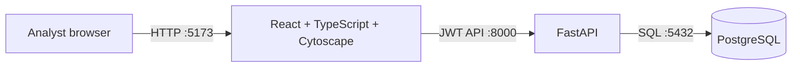
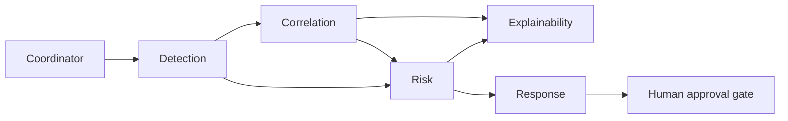
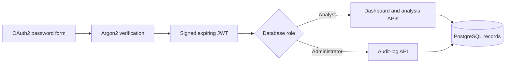
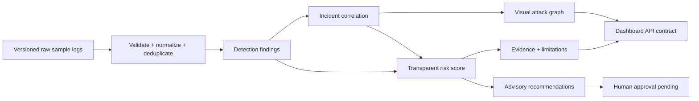
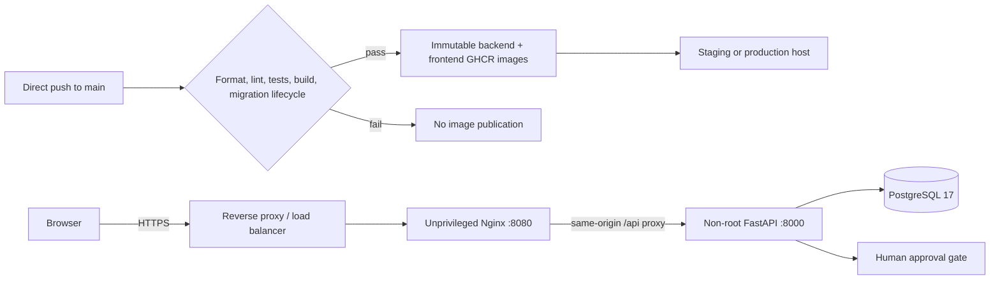

# Foundation architecture

The Phase 2 development environment has three services managed by Docker Compose.

The backend owns validation and persistence. The frontend never connects directly to the database.
Browser requests from configured `CORS_ORIGINS` are accepted by the backend; the default permits the
local Vite development server at `http://localhost:5173`.
Offline ML training and evaluation live under `ml/`. The backend's bounded Phase 5 agents integrate
the intelligence components through strict service contracts and a failure-aware coordinator.

## Intelligence workflow

Every arrow is a validated `phase5-v1` Pydantic handoff. The coordinator returns ordered audit
digests and keeps the approval gate pending; no response component has an execution capability.

## Authentication and analyst surface

The browser keeps the bearer token in memory, calls only versioned backend endpoints, and never
connects to PostgreSQL. The server reloads account state for each token-authenticated request.

## Phase 7 acceptance path

`backend/app/acceptance.py` executes this bounded path with the versioned synthetic sample and
records counts, response time, input hash, safety state, and pass/fail criteria. API contract tests
exercise authenticated workflow responses; the Docker validation additionally checks the
PostgreSQL-backed analyst endpoints used by the React dashboard.

## Service boundaries

| Component | Current responsibility | Later responsibility |
| --- | --- | --- |
| Frontend | Authenticated analyst dashboard and interactive attack graph | Additional accessibility and operational views |
| Backend | Auth, RBAC, rate limiting, platform APIs, agents, audit logging | External identity and deployment integrations |
| PostgreSQL | Users, events, alerts, incidents, graphs, explanations, feedback, audits | Migration-managed production persistence |
| ML | Preprocessing, Logistic Regression, SHAP, causal GraphSAGE | Versioned model artifacts and additional training |

## Phase 8 delivery layout

The repository supplies images and Compose manifests but does not contain cloud credentials or
select a hosting vendor. Production ports bind to loopback so a separately managed HTTPS endpoint
can enforce certificates and external access policy. PostgreSQL is not published to the host.
