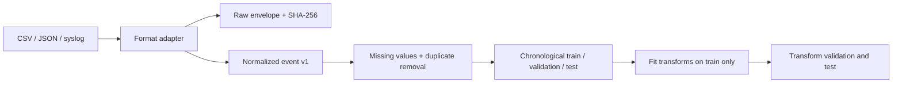

# Phase 3 data pipeline

The pipeline keeps source records replayable and separates ingestion from model preparation.



## Ingestion behavior

The adapters in `backend/app/ingestion/` support:

- CSV with a required header row;
- JSON objects, arrays, `{ "events": [...] }`, JSONL, and NDJSON;
- RFC 5424 and RFC 3164 syslog lines, including `key=value` message fields.

Common aliases such as `src_ip`, `dst_ip`, `username`, `hostname`, `proto`, and `level` map into the
normalized event contract. ISO 8601, common delimited timestamps, Unix seconds, and Unix
milliseconds are converted to UTC. Blank/placeholder fields become missing values, missing severity
defaults to `informational`, and unknown fields remain in `attributes`.

Each source payload receives a canonical SHA-256 checksum. Duplicates within a batch are skipped;
callers can pass checksums already stored in `raw_events` to remove duplicates across batches. Invalid
records produce row-level errors without discarding valid rows. The database also has a unique
constraint on `raw_events.checksum` as the final persistence guard.

Run ingestion while keeping raw and normalized streams separate:

```powershell
python -m app.ingestion.cli data\samples\synthetic-events-v1.csv `
  --format csv `
  --log-source synthetic `
  --raw-output data\processed\synthetic-v1.raw.jsonl `
  --normalized-output data\processed\synthetic-v1.normalized.jsonl
```

`data/processed/` is ignored because both files are reproducible derivatives. Do not place uploaded
organizational logs in `data/samples/`.

## Leakage-safe preprocessing

`ml/configs/preprocessing-v1.json` versions the feature list and split policy. The implementation:

1. validates required columns and converts configured missing markers;
2. removes identical rows and parses timestamps as UTC;
3. sorts rows by event time and creates contiguous 70/15/15 partitions;
4. fits numeric median imputation and standard scaling on training rows only;
5. fits categorical constant imputation and one-hot encoding on training rows only;
6. transforms validation and test without refitting, ignoring previously unseen categories.

Inspect the prepared dataset summary with:

```powershell
python -m ecti_ml.cli data\samples\synthetic-events-v1.csv `
  --config ml\configs\preprocessing-v1.json
```

The test partition is final evaluation data. Tuning, early stopping, feature selection, and threshold
selection may use only training and validation data.
