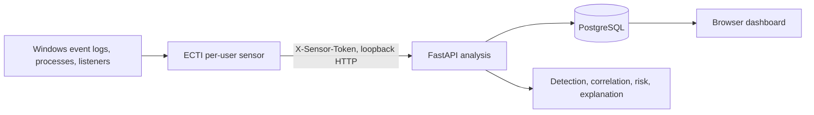

# Windows endpoint sensor

## Why it exists

Browser security prevents a React website from reading Windows Event Log, process metadata, or TCP
listeners. Docker containers also do not receive unrestricted visibility into the Windows host.
ECTI therefore uses a small host process for collection while keeping investigation in the browser.



## Collected signals

- Microsoft Defender event IDs 1116, 1117, and 1121;
- failed sign-in event 4625, blocked connection 5157, and service installation 7045 when the current
  account can read the relevant log;
- a narrow pattern list for suspicious PowerShell, `mshta`, `regsvr32`, and `rundll32` process
  invocation;
- newly observed listeners on ports 1337, 4444, 5555, 6666, and 31337;
- hostname, OS/agent version, validated local IP addresses, capabilities, and heartbeat.

Process command lines are locally reduced to a SHA-256 digest before transmission. The sensor does
not read file contents, documents, browser history, keystrokes, clipboard data, or credentials.
State is saved atomically only after a batch is accepted, allowing retry after an API failure.

## Detection path

Every source signal has a stable event key. The backend authenticates the batch, updates server-time
heartbeat state, discards duplicates, normalizes new events, and passes them through the existing
bounded workflow. Resulting alerts, incidents, explanations, attack graphs, receipts, and audits are
stored in PostgreSQL. No response action is executed.

## Install and operate

The release bundle requires Windows and Docker Desktop:

```powershell
.\installer\windows\Install-ECTI.ps1
# after reboot
.\installer\windows\Start-ECTI.ps1
# stop both sensor and containers
.\installer\windows\Stop-ECTI.ps1
```

The default install is `%LOCALAPPDATA%\ECTI`; sensor state/logs are under
`%LOCALAPPDATA%\ECTI\data`. The installer creates secrets locally and opens
<http://127.0.0.1:8080> for one-time owner setup.

The sensor deliberately runs under the current user without a scheduled task or SYSTEM service.
This makes persistence and privilege visible rather than silently changing the machine. It also
means protected log channels may be unavailable. Elevated/service deployment and automatic startup
would require an explicit administrator-approved design and uninstall path.

## Limitations

This is an explainable prototype sensor, not full EDR. It does not provide kernel telemetry,
memory scanning, behavioral sandboxing, tamper protection, automatic containment, signature
updates, or guaranteed detection of novel attacks. Microsoft Defender remains the primary endpoint
security control.
