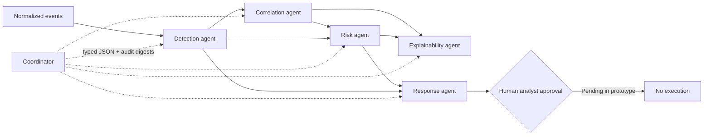

# Phase 5 multi-agent workflow

Phase 5 adds a bounded orchestration layer around the Phase 4 intelligence modules. The word
"agent" means a typed component with one responsibility; no component can choose tools, execute
security controls, or bypass the coordinator. All contracts use `phase5-v1` Pydantic models and
forbid unexpected request fields.

## Workflow



| Component | Input | Output | Responsibility |
| --- | --- | --- | --- |
| Detection | Normalized events | Classifications, confidence, anomaly score, feature signals | Run the versioned online detection baseline |
| Correlation | Events and findings | Correlated incidents and attack graph | Group non-benign events and maintain deterministic attack paths |
| Risk | Events, findings, incidents, context | Ordered risk assessments | Apply the documented `risk-v1` formula |
| Explainability | Findings, risk, graph | Analyst-readable explanations and evidence IDs | Preserve model signals, graph evidence, confidence, and limitations |
| Response | Events, findings, risk | Deduplicated recommendation bundles | Map assessed risk to safe mitigation recommendations |
| Coordinator | Workflow request | Results, audit trail, failures, approval gate | Validate handoffs, sequence stages, isolate failures, and prevent execution |

The detection component uses `severity-anomaly-baseline` version `1.0.0`, a deterministic online
baseline. It is intentionally separate from the offline Logistic Regression and GraphSAGE
experiment. Its score combines event severity, documented event-type/action markers, and an
optional validated `attributes.anomaly_score`. This makes workflow demonstrations reproducible;
it is not a claim of production detection accuracy.

## API contracts

All endpoints are under `/api/v1`:

- `POST /agents/detection/run`
- `POST /agents/correlation/run`
- `POST /agents/risk/run`
- `POST /agents/explainability/run`
- `POST /agents/response/run`
- `POST /workflows/analyze`

Each component endpoint accepts its dedicated request schema and returns its dedicated result
schema. The workflow endpoint runs all five stages. FastAPI publishes full field definitions and
examples of validation errors at `/docs` and `/openapi.json`.

Run the versioned test fixture against a local backend:

```powershell
$body = Get-Content backend\tests\fixtures\phase5-workflow-v1.json -Raw
Invoke-RestMethod `
  -Uri http://localhost:8000/api/v1/workflows/analyze `
  -Method Post `
  -ContentType application/json `
  -Body $body
```

The fixture contains two related attack-classified authentication events and one benign heartbeat.
It is the shared test input for individual agent contracts and the integrated coordinator flow.

## Audit and failure behavior

Every coordinator response contains exactly one ordered audit record for each stage. Completed
records include SHA-256 input and output digests; failed and skipped records include the reason.
The stable workflow ID is derived from the validated request, so replaying identical input yields
the same ID while execution timestamps remain truthful.

| Failure | Coordinator behavior |
| --- | --- |
| Detection fails | Mark workflow failed and skip all dependent stages |
| Correlation fails | Continue risk, explanation, and response with an empty graph/incident handoff |
| Risk fails | Continue explanation without risk, but skip response recommendations |
| Explainability fails | Preserve detection/risk results and continue response recommendations |
| Response fails | Return prior analysis with partial-failure status and no recommendations |

The audit trail is part of the API response and is therefore testable, but it is not yet a durable
database audit log. Durable workflow persistence, authentication, and analyst approval endpoints
belong to Phase 6.

## Human-control guarantee

Every workflow ends with `human_approval.required=true`, `approval_status="pending"`, and
`execution_permitted=false`. Every recommendation also carries
`requires_human_approval=true` and `automatic_execution=false`. Phase 5 exposes no execution route,
so a component failure cannot silently fall back to an automated security action.
